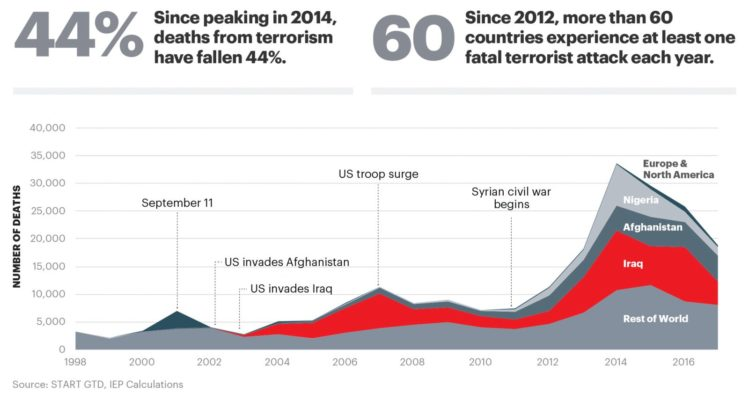

# **INFO201 FINAL PROJECT | PROPOSAL**  

**Project Code Name:** Global Terrorism  
**Authors:** Joseph Altamira, Jazmynn Combes-Troyer, Dorothy Lu

**Affiliation:** Info-201: Technical Foundations of Informatics  
The Information School  
University of Washington  
Autumn 2019  

## 1.0 INTRODUCTION PROBLEM SITUATION  
### 1.1 Problem Situation:
Terrorism is the unlawful and systematic use of violence against a state, country, or group of people, motivated by various ideologies, as a form of political coercion. It occurs on local, national, and international levels. Take - for instance - the white supremacist attack at the "Unite the Rally" attack in 2019, which occurred on US soil in Charlottesville, VA by Americans, and the infamous al-Qaeda attack on the USA on September 11, 2001, which was a national terrorist attack.
_Direct stakeholders_ include political entities (i.e. a government, political figure, or organization), both as targets and instigators. As instigators, political entities  plan and execute attacks against other states, nations, other political groups, or specific political figures to further some political, religious, or other ideological objective. _Indirect stakeholders_ include civilians residing in or around the targeted person, group, or nation.  
Terrorism is a result of political, religious, and other ideological tensions as well as differing fundamental values between different groups of people. This may include and affect political policies (regarding national security, political interference with other states and nations, and use of military forces) and humanitarian ethics (for example, those ethics and policies imposed and established by the United Nations).    

### 1.2 What is the Problem?
Acts of terrorism are violent and often ineffective ways of furthering a political or ideological agenda. Hundreds, thousands, and even millions of innocent civilians suffer as a result of terroristic attacks (i.e. the Boston Marathon Bombing, 9/11, the Pulse Nightclub shooting in Orlando, etc.). In addition to civilian casualties, terrorism causes political unrest within the targeted population's government and people. This can cause instability, thus resulting in economic, social, and political deterioration. Furthermore, terrorism can have a significant impact on international relations, as we have seen with the United States and middle eastern countries like Iraq and Afghanistan.

### 1.3 Why Does It Matter?  
Terrorism affects individuals, communities, and societies on multiple levels.  Aside from the obvious physical and psychological impacts on direct victims of terrorism, terrorism causes deep-rooted fear and insecurity within affected populations. This uncertainty for safety also has direct effects on the economy (both direct economic destruction and market uncertainty) to the political health of the State. This political unrest could lead to more violence and further instability, which could be more dangerous for innocent civilians and result in international repercussions as those civilians could potentially try to immigrate. In short, terrorism has great political, economic, and humanitarian impacts on targeted populations.  

### 1.4 How Will it be Addressed?  
The sensitive subject of terrorist attacks will be addressed by bringing attention to the underlying issues that bring forth terrorism and its subsequent political violence. By understanding the root causes and finding correlations between various data about those attacks (date, location, cause, etc.), we can raise awareness and educate the public about various aspects of terrorism and about targeted regions that are not widely publicized by the media. This could potentially help with prevention and perhaps lower the severity of the attacks around the world.

## 2.0 RESEARCH QUESTIONS  
- Can we predict where there might be another terrorist attack in the future? Are there other datasets we can use to further find relationships between certain aspects of attacks (ex: New political developments)? (What can we find using this data set?)   
- What correlations exist between terrorist attacks that have been publicized by the media and occurrences of terrorist attacks in those areas? Can this data be used to potentially provide training to areas that are more likely to experience an attack? (Publicized attacks vs recorded.)  
- How might people using this dataset cut down the random acts of terrorism (data that seems to not have any sufficient meaning for the current problem) to provide a much more accurate representation of the nature of these terrorism attacks due to certain causes? (Determining good vs bad data)  

## 3.0 POSSIBLE DATASETS  
Describe two possible data sets that you might work with. Include name, short description [30-60 words], link, and number of observations and number of attributes. - Jaz
- [This interactive tool](https://mihiriyer.shinyapps.io/MentalHealth/) shows statistics from the Veterans Affairs department for 2015. You can search by such measures as prevalence, testing, and confirmed diagnosis percentages at VA hospitals around the USA.
- [This dataset](https://data.world/data-society/global-terrorism-data) provides a lot of data. More information can be found at https://data.world/data-society/global-terrorism-data  
- [This dataset](https://www.kaggle.com/doyouevendata/cato-2017-human-freedom-index#cato_2017_human_freedom_index.csv)  

## 4.0 INFORMATION VISUALIZATIONS

_Figure 1_. This graphic shows the impact of terrorism by country. By using progressing shades of red to differentiate how much each country is impacted on the world map, viewers can see trends of where terrorism has the largest influence by area. This help us more easily pinpoint which regions of the world suffer most from terrorism and guide further research and exploration into why that may be.   

_Figure 2_. This graphic shows the global number of deaths by terrorism per year, highlighting key events and differentiating countries with the highest death rates. By charting the countries with the highest death rates in comparison to the rest of the world, viewers can see how high the impact of terrorism is within those countries. This visualization shows which countries were most affected by terrorist attacks in relation to one another, particularly countries that are highly publicized in countries like the USA (i.e. Iraq and Afghanistan). This can help us better contextualize these attacks in history, which can help us address our potential research questions.

## 5.0 TEAM COORDINATION  
### 5.1 When Can the Team Meet?  
The team will plan to meet weekly for at least two hours on Fridays from 10:00AM to 12:00PM. Additional meeting times will be scheduled, especially near the deadlines for deliverables.

### 5.2 How Will the Team Communicate?  
The group will use Facebook Messenger for all communication.

### 5.3 How Will the Team Give and Receive Feedback?  
> “Communication is the lubrication of any good relationship.” - Boundless Boi in B CMU  

Feedback on deliverables will be given to each other through Google Doc comments as well as through Messenger before they are due.  All feedback will be polite and constructive, and will never be a direct attack against a team member.  
If there are any communication challenges, we will address it through messenger first.  If the problem is not able to be resolved, we will schedule a group meeting to further probe the issue.  In the case that the problem cannot be resolved through discussion alone, we will talk to a TA or schedule a meeting with the professor.  

### 5.4 What Are Our Individual Goals and Roles?  
**Joseph:** To create a project that can be used as an aid to those who want to spread awareness of a global issue and allow discourse into a subject that many people tend to avoid because of political correctness.    
**Jazmynn:** To create a clean, polished product that I can include in my portfolio and to gain insight about international political and humanitarian issues, as those are subjects in which I am not well-versed. I would also like to further develop and expand my proficiency in R.  
**Dorothy:** To increase my proficiency in R using a project reflective of real-life data visualization projects while exploring global issues, as well as to create a portfolio piece I can be proud of.

**Roles:** Each group member will contribute an equal amount to the design and technical development of the final product, as each member would like more experience in each aspect (design, development, research, etc.) of this project.

## 6.0 QUESTIONS AND COMMENTS  
We have no questions or comments about the project at this time.

## 7.0 REFERENCES  
http://visionofhumanity.org/app/uploads/2017/11/Global-Terrorism-Index-2017.pdf

Loayza, N. (2016, July 29). How to defeat terrorism: Intelligence, integration, and development. Retrieved from https://www.brookings.edu/blog/future-development/2016/07/25/how-to-defeat-terrorism-intelligence-integration-and-development/.
